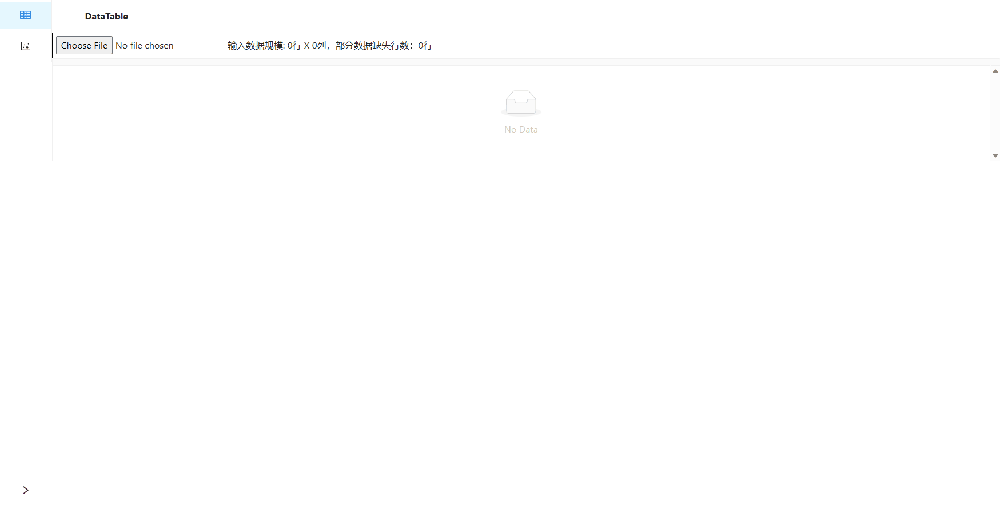
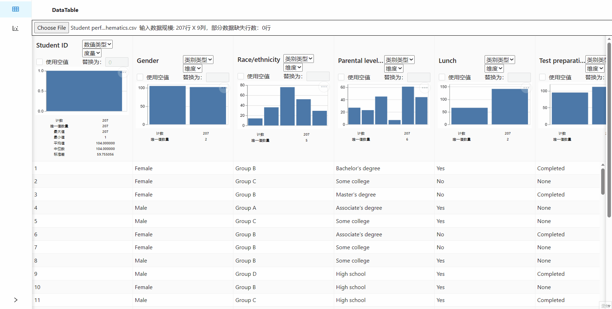
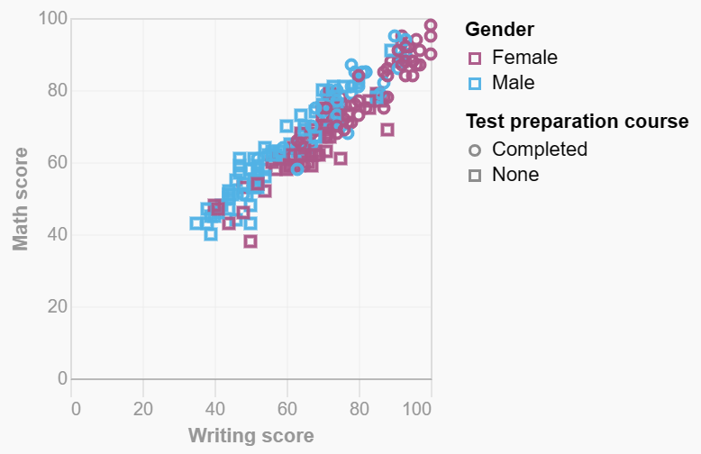
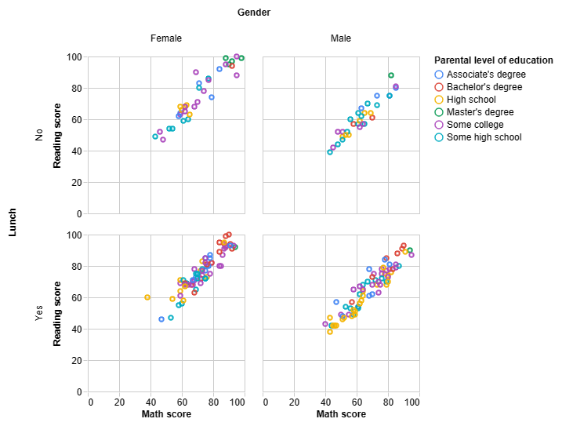
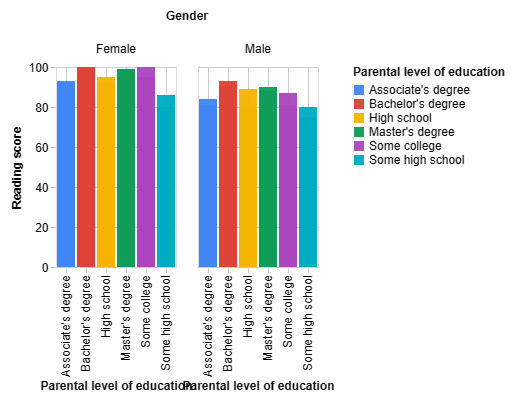

# Multidimensional Chart 
## Introduction 
This is my personal project for graduating from university. 

It is a simple tool that can help plot charts and analyse data. It has the following functions.  
1. Import files, lile `.xls`、`.xlsx`、`.csv`、`.json`.
2. Infer data type automatically.
3. Calculate general statistical values.
4. Fill empty values.
5. Draw a chart by dragging and dropping labels.
6. Switch themes.
7. ……

## Examples 
Video url: [Multidimensional chart](https://www.bilibili.com/video/BV1JX4y1a7pG/?spm_id_from=333.999.0.0&vd_source=f62bb9a0433172c07fff04f387f0ebb7) 

DataTable

SketchPad

Chart1

Chart2

Chart3 

## Reference 
The product's design mainly refers to [Rath](https://github.com/Kanaries/Rath) and [GraphicWalker](https://github.com/Kanaries/graphic-walker)
